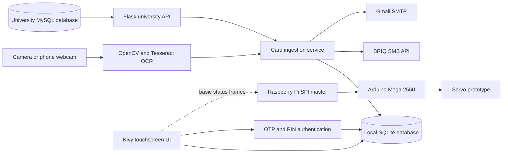

# Smart ID Card Issuance Kiosk

A prototype university ID-card issuance system that combines a Raspberry Pi application, OCR-based card registration, local SQLite storage, student authentication, SMS/email credential delivery, and an Arduino Mega hardware-control prototype.

> **Project status:** Active prototype. The software modules are partly integrated, while physical card dispensing is still simulated in the current Kivy application.

---

## Table of Contents

- [Project Overview](#project-overview)
- [Current Implementation Status](#current-implementation-status)
- [System Workflow](#system-workflow)
- [Architecture](#architecture)
- [Technology Stack](#technology-stack)
- [Repository Structure](#repository-structure)
- [Kiosk Application Setup](#kiosk-application-setup)
- [Database Setup](#database-setup)
- [Mock University API Setup](#mock-university-api-setup)
- [Running the OCR Pipeline](#running-the-ocr-pipeline)
- [Running the Kiosk UI](#running-the-kiosk-ui)
- [Firmware Setup](#firmware-setup)
- [Testing](#testing)
- [Configuration Reference](#configuration-reference)
- [Security Design](#security-design)
- [Known Limitations](#known-limitations)
- [Development Priorities](#development-priorities)
- [Documentation and Hardware Files](#documentation-and-hardware-files)
- [License](#license)

---

## Project Overview

The project is intended to automate the storage and collection of university identity cards.

The repository currently contains four main parts:

1. **Raspberry Pi kiosk application**
   - Kivy touchscreen interface
   - Student registration-number entry
   - OTP verification
   - Temporary and permanent PIN handling
   - SQLite card and authentication records
   - Session timeout and lockout screens

2. **OCR and card-ingestion pipeline**
   - Camera image capture
   - Card contour detection
   - Perspective correction
   - Registration-number region extraction
   - Tesseract OCR
   - University API lookup
   - Local card-slot assignment

3. **Mock university database API**
   - Flask REST API
   - MySQL-backed student lookup
   - API-key authentication
   - Student-field normalization

4. **Hardware-control prototype**
   - Arduino Mega 2560 PlatformIO project
   - SPI frame reception from Raspberry Pi
   - Servo test routines
   - Hardware, PCB, mechanical, simulation, and datasheet files

---

## Current Implementation Status

| Subsystem                               | Current state                                          |
| --------------------------------------- | ------------------------------------------------------ |
| Kivy student collection interface       | Implemented                                            |
| Registration-number validation          | Implemented                                            |
| Local SQLite database                   | Implemented                                            |
| OTP generation and verification         | Implemented                                            |
| Temporary PIN and permanent PIN storage | Implemented                                            |
| Bcrypt credential hashing               | Implemented                                            |
| Authentication lockout logic            | Implemented                                            |
| SMS delivery through BRIQ Solutions     | Implemented; requires credentials                      |
| Email delivery through Gmail SMTP       | Implemented; requires credentials                      |
| University API client                   | Implemented                                            |
| Flask/MySQL mock university API         | Implemented; requires local configuration and database |
| Camera image capture                    | Implemented                                            |
| Card contour and perspective correction | Implemented                                            |
| Tesseract OCR extraction                | Implemented                                            |
| Card ingestion and four-slot assignment | Implemented                                            |
| Raspberry Pi SPI sender                 | Basic two-byte status frames implemented               |
| Arduino Mega SPI receiver               | Basic frame reception implemented                      |
| Servo prototype                         | Implemented at firmware-test level                     |
| Staff batch-loading Kivy interface      | Not integrated into `main.py`                          |
| Automatic motorised card dispensing     | Not integrated; simulated in `main.py`                 |
| Complete carousel/conveyor control      | Not implemented in the checked-in firmware             |
| Production deployment and enclosure     | Not complete                                           |

The repository documentation contains earlier STM32 and 10-slot carousel plans. The current checked-in firmware instead targets an **Arduino Mega 2560**, and the current SQLite ingestion logic assigns a maximum of **four active slots**.

---

## System Workflow

### Card registration and ingestion

```text
Camera capture
      |
      v
Card contour detection
      |
      v
Perspective correction
      |
      v
Registration-number ROI extraction
      |
      v
Tesseract OCR
      |
      v
University API lookup
      |
      v
Generate OTP and temporary PIN when required
      |
      v
Store student, authentication, card, and audit records in SQLite
      |
      v
Send credentials through SMS and email
```

### Student card collection

```text
Idle screen
      |
      v
Enter registration number
      |
      v
Check local student and card record
      |
      v
Enter six-digit OTP
      |
      +-------------------------------+
      |                               |
      v                               v
Temporary PIN exists             Permanent PIN exists
      |                               |
      v                               |
Verify temporary PIN                  |
      |                               |
      v                               |
Create permanent PIN                  |
      +---------------+---------------+
                      |
                      v
Load assigned slot
                      |
                      v
Mark card as collected
                      |
                      v
Simulated dispensing delay
                      |
                      v
Confirmation screen
```

> The returning-student branch currently proceeds after OTP verification without displaying the permanent-PIN entry screen. The authentication module contains permanent-PIN verification logic, but that step is not connected to the returning-student path in `main.py`.

---

## Architecture



### Raspberry Pi application layer

The `kiosk_brain` application is responsible for:

- Kivy user-interface screens
- Student-session state
- Local database access
- OTP and PIN verification
- OCR processing
- University API communication
- SMS and email credential delivery
- Basic SPI transmission

### Local database layer

SQLite stores:

- Students
- Cards and assigned slots
- OTP and PIN hashes
- Authentication attempts and lockouts
- Audit events
- Batch metadata

### University API layer

The mock API provides:

```http
GET /students/<registration_number>
X-API-Key: <configured-key>
```

It reads student records from MySQL and normalizes alternative field names such as:

- `reg_number` or `registration_number`
- `last_name` or `surname`
- `phone` or `phone_number`
- `status` or `registration_status`

### Hardware-control layer

The current firmware is a PlatformIO Arduino project for the Mega 2560. It currently:

- Configures the Mega as an SPI slave
- Receives two-character ASCII frames
- Prints received frames through the serial monitor
- Runs prototype servo movement routines

It does not yet implement the complete carousel, conveyor, sensor, lock, or dispensing sequence described in the planning documents.

---

## Technology Stack

### Application

- Python
- Kivy
- OpenCV
- Tesseract OCR through `pytesseract`
- SQLite
- Requests
- Bcrypt
- `spidev`
- Pytest

### API

- Flask
- MySQL Connector/Python
- MySQL

### Firmware

- PlatformIO
- Arduino framework
- Arduino Mega 2560
- Servo library
- AVR SPI interrupt handling

### Hardware and design

- Altium project files
- KiCad files
- FreeCAD files
- Simulation files
- Component datasheets
- Raspberry Pi and embedded-controller planning documents

---

## Repository Structure

```text
card-issuance-system/
├── README.md
├── BUILD.md
├── docs/
│   ├── business/
│   ├── official/
│   ├── primary/
│   ├── carousel_3d_v2.html
│   └── kiosk_architecture.html
├── firmware/
│   ├── docs/
│   ├── include/
│   ├── src/
│   │   └── main.cpp
│   ├── test/
│   └── platformio.ini
├── hardware/
│   ├── Altium/
│   ├── FreeCAD/
│   ├── datasheets/
│   ├── kiCAD/
│   ├── simulations/
│   └── README.md
├── kiosk_brain/
│   ├── main.py
│   ├── config.example.py
│   ├── requirements.txt
│   ├── modules/
│   │   ├── api_client.py
│   │   ├── auth.py
│   │   ├── capture_image.py
│   │   ├── card_detector.py
│   │   ├── database.py
│   │   ├── ocr.py
│   │   ├── session_manager.py
│   │   ├── sms_client.py
│   │   └── spi_master.py
│   ├── db/
│   │   ├── DATABASE_DESIGN.md
│   │   ├── init_db.py
│   │   └── schema.sql
│   ├── ui/
│   │   ├── constants.py
│   │   ├── screens.py
│   │   ├── styled_widgets.py
│   │   └── styles.kv
│   └── tests/
│       ├── all_test.py
│       ├── test_auth.py
│       ├── test_ingest.py
│       ├── test_spi.py
│       └── OCR output-generation scripts
└── mock_db_api/
    ├── app.py
    ├── README.md
    └── requirements.txt
```

---

## Kiosk Application Setup

### 1. Clone the repository

```bash
git clone https://github.com/musyani-io/card-issuance-system.git
cd card-issuance-system/kiosk_brain
```

### 2. Install system dependencies

Install Python, Tesseract OCR, and the operating-system packages required by Kivy and OpenCV.

On Debian, Ubuntu, or Raspberry Pi OS:

```bash
sudo apt update
sudo apt install -y python3 python3-venv python3-pip tesseract-ocr
```

Raspberry Pi hardware access also requires SPI to be enabled:

```bash
sudo raspi-config
```

Open **Interface Options**, enable **SPI**, and reboot.

### 3. Create a Python virtual environment

```bash
python3 -m venv .venv
source .venv/bin/activate
python -m pip install --upgrade pip
pip install -r requirements.txt
```

### 4. Create the local configuration file

```bash
cp config.example.py config.py
```

The current example file contains the service and OCR settings, but it also needs a `Path` import and a local database path for the checked-in modules.

Add the following near the top of `config.py`:

```python
from pathlib import Path

BASE_DIR = Path(__file__).resolve().parent
DB_PATH = BASE_DIR / "db" / "kiosk.db"
```

Then update:

- BRIQ API credentials
- Gmail SMTP account and app password
- University API address and API key
- Camera device paths
- OCR parameters when necessary

Do not commit `config.py`.

---

## Database Setup

Initialize the local SQLite database from `kiosk_brain`:

```bash
python3 db/init_db.py
```

The default database is created at:

```text
kiosk_brain/db/kiosk.db
```

To clear records and recreate the schema:

```bash
python3 db/init_db.py --reset
```

### SQLite tables

| Table            | Purpose                                      |
| ---------------- | -------------------------------------------- |
| `students`       | Local student information                    |
| `cards`          | Card status, batch, and slot assignment      |
| `authentication` | OTP, PIN, attempt counters, and lockout data |
| `audit_log`      | Authentication and card-processing events    |
| `batches`        | Batch-loading statistics                     |

The current ingestion code uses four local slots:

```text
0, 1, 2, 3
```

A slot remains occupied while its card status is not `collected`.

---

## Mock University API Setup

The mock API is optional when the local SQLite database already contains the records required by the kiosk UI. It is required for card ingestion through `ingest_card()` or the OCR pipeline.

### 1. Enter the API directory

```bash
cd ../mock_db_api
```

### 2. Create an environment

```bash
python3 -m venv .venv
source .venv/bin/activate
pip install -r requirements.txt
```

### 3. Create `config.py`

`mock_db_api/app.py` expects a local configuration file that is not committed to the repository.

Create `mock_db_api/config.py`:

```python
API_KEY = "test-key-12345"

DB_HOST = "localhost"
DB_PORT = 3306
DB_USER = "root"
DB_PASSWORD = "your-mysql-password"
DB_NAME = "card_issuance"
```

The API key must match `UNIVERSITY_API_KEY` in `kiosk_brain/config.py`.

### 4. Prepare MySQL

Create the configured database and a `students` table containing the student fields used by the application.

The API first searches by `reg_number` and falls back to `registration_number`.

Expected student information includes:

- Registration number
- First name
- Surname or last name
- Email address
- Phone number
- Programme
- Registration status

### 5. Run the API

```bash
python3 app.py
```

The default service address is:

```text
http://localhost:5000
```

Example request:

```bash
curl \
  -H "X-API-Key: test-key-12345" \
  http://localhost:5000/students/2022-04-09050
```

---

## Running the OCR Pipeline

Return to `kiosk_brain` and activate its virtual environment.

### Capture one image

```bash
python3 modules/capture_image.py
```

The capture module:

- Tries the configured video-device candidates
- Applies the configured width, height, and frame rate
- Warms up the camera
- Captures one frame
- Rotates the frame clockwise
- Saves it in the configured capture directory

### Run capture, OCR, and ingestion

```bash
python3 modules/ocr.py
```

The OCR pipeline performs:

1. Camera capture
2. Card contour detection
3. Perspective flattening
4. Registration-number ROI cropping
5. Grayscale and adaptive-threshold preprocessing
6. Tesseract OCR
7. Registration-number extraction
8. Student API lookup
9. SQLite ingestion
10. OTP and credential dispatch

Supported OCR patterns include:

```text
2022-04-09050
T/UDSM/2022/1234
```

An 11-digit compact number can also be reformatted into:

```text
XXXX-XX-XXXXX
```

### Ingest a known registration number without OCR

```bash
python3 -c \
"from modules.database import ingest_card; print(ingest_card('2022-04-09050'))"
```

Replace the example with a registration number that exists in the mock university database.

---

## Running the Kiosk UI

From `kiosk_brain`:

```bash
python3 main.py
```

The UI is configured for:

```text
800 × 400 pixels
```

### Current screens

- Idle
- Registration-number entry
- OTP entry
- PIN entry
- PIN setup
- Waiting
- Confirmation
- Error
- Locked

### Current validation values

| Setting                      |         Value |
| ---------------------------- | ------------: |
| Registration-number length   | 13 characters |
| OTP length                   |      6 digits |
| PIN length                   |      4 digits |
| Registration lookup attempts |             3 |
| OTP attempts                 |             3 |
| PIN attempts                 |             3 |
| Inactivity timeout           |    15 seconds |
| Confirmation timeout         |    15 seconds |
| Locked-screen display        |     5 seconds |

The Kivy UI reads already-ingested records from SQLite. It does not perform card ingestion itself.

---

## Firmware Setup

The current firmware targets an **Arduino Mega 2560**.

### Requirements

Install PlatformIO Core or use PlatformIO inside Visual Studio Code.

### Build

```bash
cd firmware
pio run
```

### Upload

Connect the Mega 2560 and run:

```bash
pio run --target upload
```

### Open the serial monitor

```bash
pio device monitor --baud 115200
```

### Current firmware behaviour

The firmware currently:

- Attaches prototype servos to pins 22, 23, and 24
- Configures hardware SPI slave pins on the Mega
- Receives two-byte ASCII frames
- Prints received frames to the serial monitor
- Runs a servo movement test during startup

### Current SPI interface

Raspberry Pi configuration in `modules/spi_master.py`:

| Parameter  | Value               |
| ---------- | ------------------- |
| SPI bus    | 0                   |
| SPI device | 0                   |
| Speed      | 100 kHz             |
| Mode       | 0                   |
| Frame type | Two-character ASCII |

Status frames:

| Frame | Meaning                                   |
| ----- | ----------------------------------------- |
| `00`  | Processing error                          |
| `1X`  | Processing success; `X` is the slot index |

The Mega hardware SPI pins are:

| Signal | Mega 2560 pin |
| ------ | ------------: |
| SS     |            53 |
| MOSI   |            51 |
| MISO   |            50 |
| SCK    |            52 |

Use a common ground between the Raspberry Pi and Arduino. Apply appropriate 5 V-to-3.3 V level shifting where required to protect the Raspberry Pi.

---

## Testing

From `kiosk_brain`:

```bash
pytest tests/test_auth.py tests/test_ingest.py tests/test_spi.py
```

The repository also contains scripts that generate intermediate OCR images for:

- Card detection
- Perspective correction
- Preprocessing
- ROI extraction
- OCR output inspection

These scripts are development utilities rather than normal unit tests.

---

## Configuration Reference

### Kiosk configuration

`kiosk_brain/config.py` controls:

- `DB_PATH`
- `UNIVERSITY_API_BASE_URL`
- `UNIVERSITY_API_KEY`
- `BRIQ_API_KEY`
- `BRIQ_SENDER_ID`
- `BRIQ_BASE_URL`
- `SMTP_EMAIL`
- `APP_PASSWORD`
- Camera device candidates
- Capture dimensions and frame rate
- Card-detection thresholds
- Perspective output size
- Registration-number ROI
- OCR preprocessing values

### Mock API configuration

`mock_db_api/config.py` controls:

- `API_KEY`
- `DB_HOST`
- `DB_PORT`
- `DB_USER`
- `DB_PASSWORD`
- `DB_NAME`

### Secrets

The following must remain outside version control:

- API keys
- SMTP app passwords
- MySQL passwords
- Production database addresses
- Any real student data

---

## Security Design

The authentication module includes:

- Cryptographically generated six-digit OTPs
- Cryptographically generated four-digit temporary PINs
- Bcrypt hashing for OTPs and PINs
- OTP expiry after 24 hours
- OTP lockout after repeated failures
- PIN lockout after repeated failures
- Temporary-to-permanent PIN transition
- Audit logging
- Session teardown and inactivity handling

### Authentication behaviour

- OTP lockout is configured for 30 minutes after the threshold is reached.
- PIN lockout is configured for 24 hours after the threshold is reached.
- Credentials are sent independently through SMS and email.
- Credential delivery is considered successful when at least one channel succeeds.
- Plaintext OTPs and PINs should never be stored in the database or written to production logs.

---

## Known Limitations

1. **Dispensing is simulated.**  
   `main.py` displays a simulated delay instead of commanding the physical dispenser.

2. **Card status is updated before physical confirmation.**  
   The current flow marks a card as `collected` before simulated dispensing completes. A production version should update the database only after receiving a verified hardware-success response.

3. **Returning-student permanent PIN is not wired into the UI flow.**  
   The authentication module supports permanent-PIN verification, but the current returning-student branch proceeds after OTP verification.

4. **The firmware is an early prototype.**  
   It receives SPI frames and tests servo movement but does not yet execute complete carousel or conveyor commands.

5. **The software and planning documents differ.**  
   Several documents describe STM32 firmware, a three-byte protocol, 1 MHz SPI, and a 10-slot carousel. The checked-in code uses Arduino Mega 2560, two-byte ASCII frames, 100 kHz SPI, and four software slots.

6. **Staff batch-loading UI is not integrated.**  
   Card ingestion is available through the OCR module and database functions, not through the current Kivy `main.py` interface.

7. **Local configuration files are required.**  
   `kiosk_brain/config.py` and `mock_db_api/config.py` must be created locally.

8. **The example kiosk configuration needs two additions.**  
   The checked-in `config.example.py` uses `Path` and the application imports `DB_PATH`, but the example does not currently define both.

9. **The mock API requires a separately prepared MySQL schema.**  
   A MySQL student-table creation script is not included in `mock_db_api`.

10. **No production security boundary has been established.**  
    The development API uses a static API key and HTTP by default. Production deployment should use HTTPS, secret management, restricted network access, and stronger service authentication.

---

## Development Priorities

The following changes are required before a complete hardware demonstration:

1. Connect the returning-student flow to permanent-PIN verification.
2. Move `mark_card_collected()` after confirmed hardware dispensing.
3. Replace simulated dispensing with SPI command and acknowledgement handling.
4. Define one authoritative controller and protocol specification.
5. Implement carousel homing and slot movement.
6. Implement conveyor, ejector, lock, and sensor state machines.
7. Add SPI checksums, timeouts, retries, and fault codes.
8. Integrate the staff batch-loading workflow into the Kivy application.
9. Add a MySQL schema and seed data for `mock_db_api`.
10. Correct and expand the example configuration files.
11. Add end-to-end tests covering OCR, API, database, authentication, SPI, and physical dispensing.
12. Update older planning documents so they match the selected hardware.

---

## Documentation and Hardware Files

The repository includes:

- Business and concept documents
- Semester reports
- Presentation files
- Architecture diagrams
- Mechanical carousel visualisation
- PCB design directories
- CAD files
- Simulations
- Component datasheets
- Build-progress notes

Some of these files describe planned architecture rather than the behaviour of the current source code. For implementation work, use the checked-in source files as the current reference.

---

## License

No software license file is currently included in the repository. Add a license before distributing or accepting external contributions.
